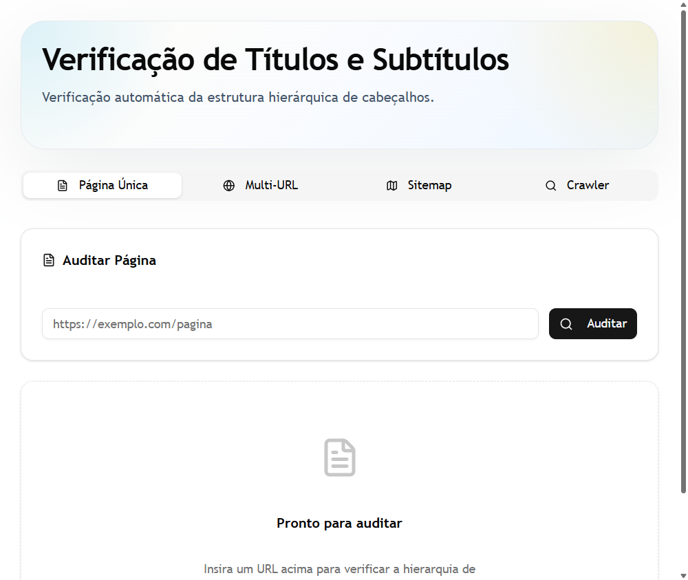
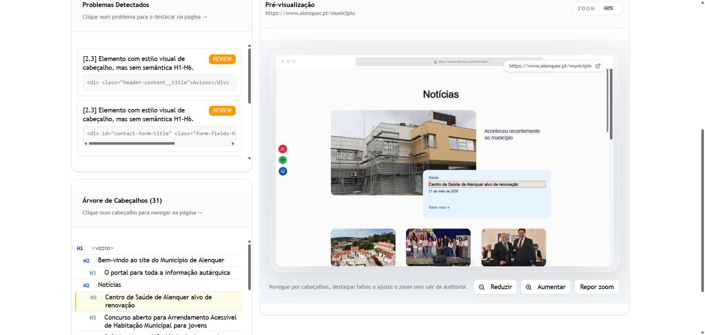

<div align="center">
   <h1>VTeS (Validador de Títulos e Subtítulos)</h1>
   <p>
   
   


 
   </p>
</div>
Esta é uma ferramenta desenvolvida para validar a estrutura de cabeçalhos em páginas web.

---

### Iniciar a Aplicação

Execute o comando:

```bash
docker-compose up --build -d
```

Abra a ferramenta através do endereço: **http://localhost:3002**

---

## Utilização

A plataforma tem quatro modos. Abaixo, está como utilizar o modo de **Página Única**.

### Página Única

Este modo permite inserir um URL e retorna possíveis problemas com a hierarquia de títulos e subtítulos.

<div align="center">
  
</div>

O sistema irá processar a página e devolver o resultado com duas áreas:

**Relatório de Hierarquia**: Uma extração que apresenta se a árvore de H1, H2 e H3 está consistente.
**Visualização da Página**: A página é renderizada com as secções em destaque, permitindo visualizar o posicionamento de cada cabeçalho.

<div align="center">
  
</div>

### Outros Modos Disponíveis

- **Sitemap**: Extração e análise de múltiplas páginas a partir do URL de um sitemap.xml.

- **Crawler**: Exploração e verificação automática de um website.

- **Validação Multi-URL**: Análise de uma lista de URLs.

---

## Páginas Testadas

Por enquanto, a ferramenta foi testada nas seguintes páginas:

[Notícias de Alenquer](https://www.alenquer.pt/noticias)
